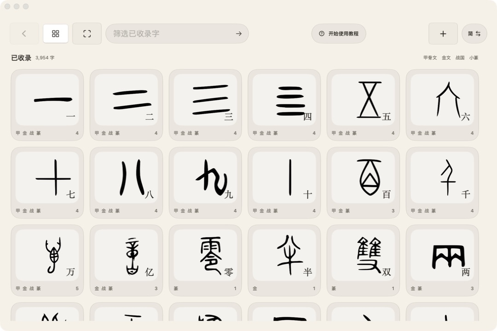

# 温古茶

古文字查询与识别app

> 本人做甲骨文研究时发现一一查找网页太麻烦，于是做了这个小工具！自己动手，丰衣足食！

温古茶是一款为 macOS 设计的古文字查询、字形浏览和图像识别工具。它把甲骨文、金文、战国文字和小篆按时代组织在同一字条中，并保留来源、编号、释读、字义和备注，适合文字学入门、课堂展示、资料检索以及古文字图片的辅助辨认。



## Built with Codex + GPT-5.6

**Codex, powered by GPT-5.6, was the primary engineering copilot used to turn the original Linux/AMD64 OCR submission into a complete, tested macOS application.** It was used throughout the project in the following ways:

- **Repository and model analysis:** Codex inspected the original `generate_submission.py`, `run.sh`, model documentation, checkpoint metadata, and tensor input/output shapes before any large-scale changes were made. It also documented the limitations of the original Linux/AMD64 workflow on Apple Silicon.
- **Architecture and implementation:** Codex helped design the separation between the SwiftUI interface, SQLite catalogue, search normalization, image resources, and the standalone OCR inference layer, then assisted with implementing and integrating those components.
- **Reliable OCR integration:** Codex traced the recognizer's 4,113-class label order directly from the checkpoint, preserved the verified class-to-label mapping, and ensured that unknown `ZHFD-...` identifiers were never guessed or silently converted into Chinese characters.
- **Search and research experience:** Codex assisted with simplified, traditional, and variant-character lookup; period-based glyph grouping; source metadata; expandable definitions; confidence-aware Top-5 OCR results; tutorials; and light/dark appearance modes.
- **Testing and debugging:** Codex helped reproduce a macOS 26 freeze caused by repeatedly expanding very long definitions, implemented a bounded image cache and stable expansion layout, and added automated data validation, OCR smoke tests, and a 200-cycle layout stress test.
- **Build and release engineering:** Codex assisted with Apple Silicon builds, local signing, DMG packaging, release validation, and checksums while preserving the original model files.

Codex and GPT-5.6 accelerated engineering, debugging, and documentation, but they did not replace paleographic judgment. Character meanings, glyph sources, OCR labels, and uncertain recognition results remain traceable and reviewable; final product decisions and validation were performed by the project author.

## 功能

- 默认打开全部收录字目录，可筛选 3,954 个可搜索字条和 6,404 张离线古文字图片。
- 支持简体字、繁体字和已收录异体字统一查询，每个字条仍保留简繁字段。
- 按甲骨文、金文、战国文字、小篆等时代展示字形，并显示来源、编号、释读和说明。
- 收录 3,486 个可靠中文释义；长释义可以原位展开，各时代卡片同时保留对应时代说明。
- 界面可即时切换繁体或简体，首次启动及“开始使用教程”提供操作说明。
- 上传古文字图片后调用本地 OCR，返回 Top-5 原始候选及未经校准的置信度。
- OCR 使用 YOLO 检测器和 EfficientNet-B0 识别器；不把未知 `ZHFD-...` 标签猜成汉字。
- 淡米白色原生 SwiftUI 界面；macOS 26 及以后使用 Liquid Glass，macOS 15–25 自动采用系统材质兼容样式。

## 运行环境

- Apple Silicon Mac（arm64）
- macOS 15 或更高版本
- 当前版本：1.0.0
- 完整 App 约 806 MB，内含离线 OCR 运行时，不需要另装 Python

可直接在仓库的 [Releases](https://github.com/enshuwu46-png/ancient-ocr-macos/releases) 页面下载 `WenGuCha-v1.0.0-macOS-arm64.dmg`，打开后将“温古茶.app”拖到“Applications”。如果 macOS 首次拦截未公证的本地签名版本，请在 Finder 中右键 App 并选择“打开”。

## 源码结构

```text
.
├── code/                       # 原始批量 OCR 推理脚本
├── models/                     # 原始检测与识别权重（未覆盖）
├── macOS/
│   ├── Sources/                # SwiftUI、SQLite 与 OCR 调用代码
│   ├── Scripts/                # 数据校验、导入和 OCR 封装脚本
│   ├── Resources/
│   │   ├── Glyphs/             # 已核验的离线古文字图片
│   │   ├── character_metadata.json
│   │   ├── glyph_catalog.json
│   │   └── recognition_labels.json
│   ├── Audit/                  # 数据导入和来源审计摘要
│   └── build_app.sh
├── PROJECT_ANALYSIS.md         # 原项目、模型和 Apple Silicon 分析
└── run.sh                      # 原 linux/amd64 竞赛容器入口
```

约 674 MB 的派生 OCR Python 运行时和历史构建缓存未提交到 Git；它们可由脚本重新生成。两个原始 `.pt` 模型保存在 `models/`，构建脚本不会修改模型文件。

## 从源码构建

需要 Xcode Command Line Tools、Apple Silicon 原生 Python 3.12，以及可联网安装 Python 依赖的环境。

```bash
cd macOS

# 仅第一次需要：生成 App 内嵌的离线 OCR 运行时
PYTHON=python3.12 ./build_ocr_runtime.sh

# 校验数据、编译 arm64 可执行文件、组装资源并进行本地签名
./build_app.sh
```

构建目标的最低系统版本为 macOS 15。详细的模型输入输出、缺失映射和平台限制见 [PROJECT_ANALYSIS.md](PROJECT_ANALYSIS.md)。

## 数据与准确性说明

字形图片仅纳入已核验来源条目，相关来源与许可记录在 [macOS/GLYPH_SOURCES.md](macOS/GLYPH_SOURCES.md)。中文释义和字符元数据的导入范围见 [macOS/CHARACTER_METADATA.md](macOS/CHARACTER_METADATA.md)。

模型 checkpoint 共含 4,113 个分类标签，其中部分是没有权威现代汉字映射的 `ZHFD-...` 资料编号。App 会原样显示此类结果。OCR 分数仅用于候选排序，并非经过概率校准的确定答案。

检测模型元数据涉及 Ultralytics AGPL-3.0；古文字图片、字典数据和其他第三方资料也各自受来源条款约束。闭源或商业使用前，请自行复核相关许可。
